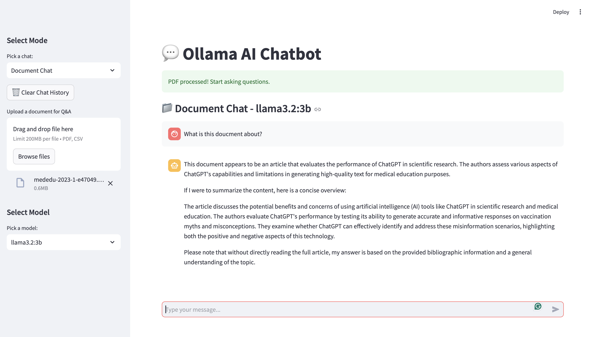

# Ollama AI Chatbot - Local RAG System

Welcome to the **Ollama AI Chatbot**, a personal learning project designed to explore Retrieval-Augmented Generation (RAG) using the Ollama framework. This repository provides a simple, interactive chatbot interface built with Streamlit, capable of processing documents (PDFs and CSVs) and images for question-answering and analysis.

The goal of this project is to experiment with local AI models, document retrieval, and multimodal capabilities (text + images) in a lightweight, customizable setup.

---

## Why Build This?

This project is ideal for:
- **Learning**: Understand how RAG systems work with documents and how vision-language models process images.
- **Experimentation**: Test different Ollama models and tweak the system for your use case.
- **Privacy**: Keep your data local without relying on cloud APIs.
- **Customization**: Simple codebase allows easy modifications for personal projects or research.

If you're curious about AI, document processing, or multimodal applications, this is a great starting point!

---

## Key Features

- **Dual Chat Modes**:
  - **Document Chat**: Upload PDFs or CSVs and ask questions based on their content using RAG.
  - **Image-based Chat**: Analyze uploaded images and ask questions about them using vision-capable models (e.g., LLaVA).
- **Model Flexibility**: Choose from available Ollama models, with automatic filtering for vision-compatible models in image mode.
- **Efficient Retrieval**: Uses FAISS and semantic chunking for fast and accurate document retrieval.
- **Local Execution**: Runs entirely on your machine, leveraging GPU acceleration where available.
- **Interactive UI**: Built with Streamlit for a clean, user-friendly experience with chat history and file previews.

---

## Prerequisites

- **Python 3.9+**
- **Ollama**: Install and configure Ollama with at least one model.
- **Hardware**: Optional GPU support for faster embeddings.

---

## Installation

1. **Clone the Repository**:
   ```bash
   git clone https://github.com/your-username/local-rag-system-ollama.git
   ```

2. **Set Up a Virtual Environment** (optional but recommended):

3. **Install Dependencies**:
   ```bash
   pip install -r requirements.txt
   ```
   *Note*: Ensure you have `requirements.txt`.

4. **Install Ollama**:
   - Follow the [Ollama installation guide](https://ollama.ai/).
   - Pull at least one model

5. **Run the Application**:
   ```bash
   streamlit run ui.py
   ```

---

## Usage

1. **Launch the App**: After running the command above, open it in your browser.
2. **Select a Mode**: Choose "Document Chat" or "Image-based Chat" from the sidebar.
3. **Upload Files**:
   - For Document Chat: Upload a PDF or CSV.
   - For Image-based Chat: Upload a PNG/JPG (optional).
4. **Pick a Model**: Select an available Ollama model from the dropdown.
5. **Ask Questions**: Type your question in the chat input and get responses based on the uploaded content or model knowledge.
6. **Clear History**: Use the sidebar button to reset the chat.

---

## Demo

Below are example screenshots demonstrating the app in action. These showcase the Document Chat and Image-based Chat functionalities.

### Document Chat Example
  
*Caption*: Asking a question about an uploaded PDF using the RAG system.

### Image-based Chat Example
  
*Caption*: Analyzing an uploaded image with a question using the LLaVA model.

*Note*: To add your own screenshots, capture them while running the app, save them in an `images/` folder in your repo, and update the paths above accordingly.

---

## Project Structure

- **`ui.py`**: Frontend code using Streamlit for the chatbot interface.
- **`processor.py`**: Backend logic for document processing, retrieval, and image handling.

---

## Limitations

- Requires Ollama models to be pre-downloaded.
- Vision capabilities depend on models like LLaVA; ensure compatibility.

---

## Contributing

This is a personal learning project, but feel free to fork and experiment! Submit issues or pull requests if you have suggestions or improvements.

---

## Acknowledgments

- Built with [Ollama](https://ollama.ai/), [Streamlit](https://streamlit.io/), and [LangChain](https://langchain.com/).

---

Happy experimenting with your local AI chatbot! Let me know if you'd like further adjustments to this README.

--- 
